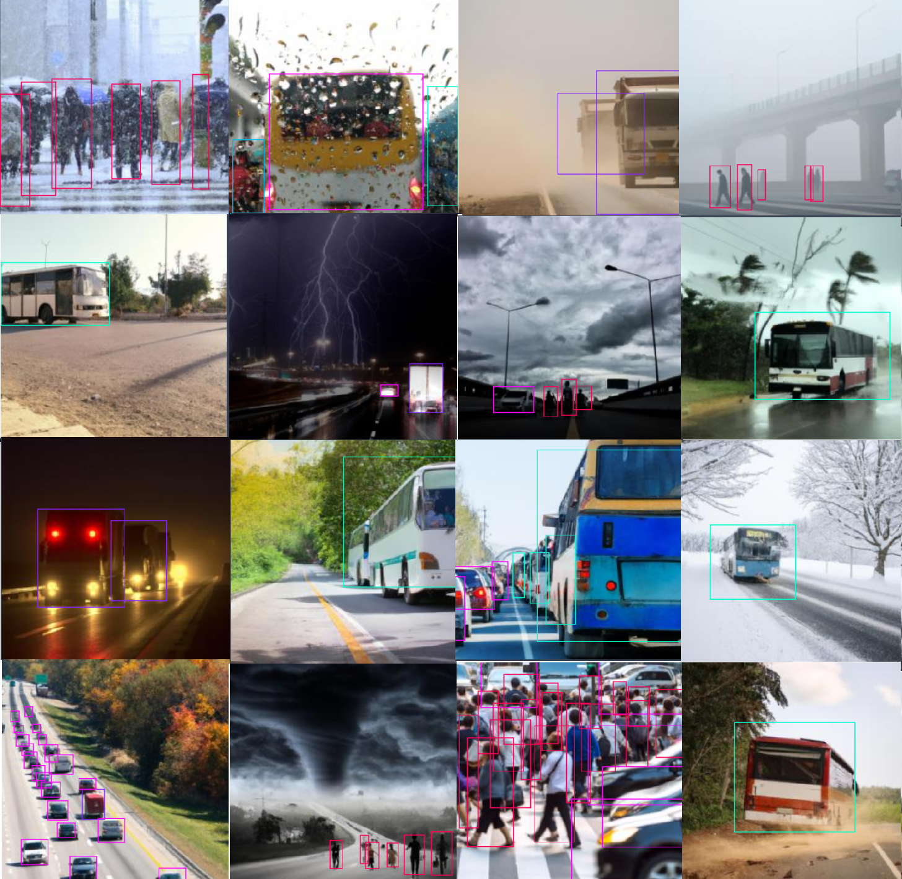

# WEDGE

This is the repository that contains website and code for our paper :

[WEDGE: A multi-weather autonomous driving dataset built from generative vision-language models](https://arxiv.org/pdf/2305.07528.pdf).

By Aboli Marathe,Deva Ramanan,Rahee Walambe and Ketan Kotecha

The dataset has been released for public use under the [CC BY-NC-SA 4.0](https://creativecommons.org/licenses/by-nc-sa/4.0/) license.

If you find our dataset useful for your work, please cite: 
```
@InProceedings{Marathe_2023_CVPR,
    author    = {Marathe, Aboli and Ramanan, Deva and Walambe, Rahee and Kotecha, Ketan},
    title     = {WEDGE: A Multi-Weather Autonomous Driving Dataset Built From Generative Vision-Language Models},
    booktitle = {Proceedings of the IEEE/CVF Conference on Computer Vision and Pattern Recognition (CVPR) Workshops},
    month     = {June},
    year      = {2023},
    pages     = {3317-3326}
}
```




For any queries, feedback or additional information you can contact the corresponding author at abolim[at]cs[dot]cmu[dot]edu.

Since this dataset is based on DALLE-2 framework, kindly abide by the following regulations:

This dataset is made freely available to academic and non-academic entities for non-commercial purposes such as academic research, teaching, scientific publications, or personal experimentation. Permission is granted to use the data given that you agree: <br>

<ul>
<li>That the dataset comes “AS IS”, without express or implied warranty. Although every effort has been made to ensure accuracy through manual inspection, we (Carnegie Mellon University, SCAAI, SIT)  do not accept any responsibility for user-defined biases in the released images. That you include a reference to the WEDGE Dataset in any work that makes use of the dataset.</li>
<li> For research papers, cite our preferred publication as listed on our website.</li> 
<li>That you do not distribute this dataset or modified versions. It is permissible to distribute derivative works in as far as they are abstract representations 
of this dataset (such as models trained on it or additional annotations that do not directly include any of our data) and do not allow to recover the dataset or something similar in character. That you may not use the dataset or any derivative work for commercial purposes as, for example, licensing or selling the data, or  using the data with a purpose to procure a commercial gain. That all rights not expressly granted to you are reserved by us (Carnegie Mellon University, SCAAI, SIT).</li> 
<li>The dataset was created under OpenAI's terms(https://openai.com/policies/terms-of-use) of use, and is AI-generated. If you feel that any image in this dataset is offensive to yourself or violates your privacy, kindly fill this takedown form (https://forms.gle/XEGVMnTAc7rrVi4w6) with the details and we shall take down the image after investigation.  </li> <br> <br> <br> <br> <br> <br>
</ul>


Dataset License: <a rel="license" href="http://creativecommons.org/licenses/by-nc-sa/4.0/"></a><br />This work is licensed under a <a rel="license" href="http://creativecommons.org/licenses/by-nc-sa/4.0/">Creative Commons Attribution-NonCommercial-ShareAlike 4.0 International License</a>.


 Website License : <a rel="license" href="http://creativecommons.org/licenses/by-sa/4.0/"></a><br />This work is licensed under a <a rel="license" href="http://creativecommons.org/licenses/by-sa/4.0/">Creative Commons Attribution-ShareAlike 4.0 International License</a>.
 This website was created using the template given in source code for the [Nerfies website](https://nerfies.github.io). <br> <br> <br>
